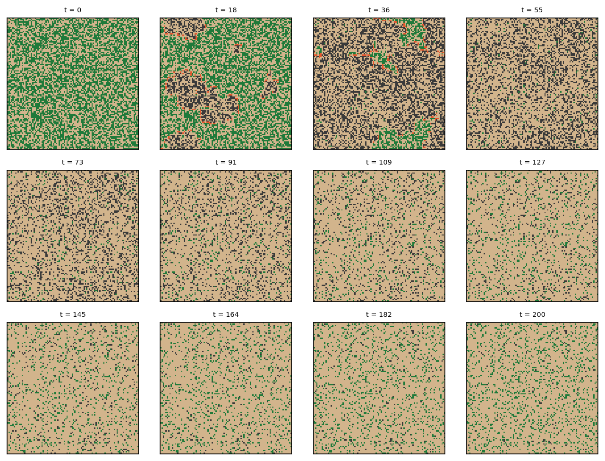
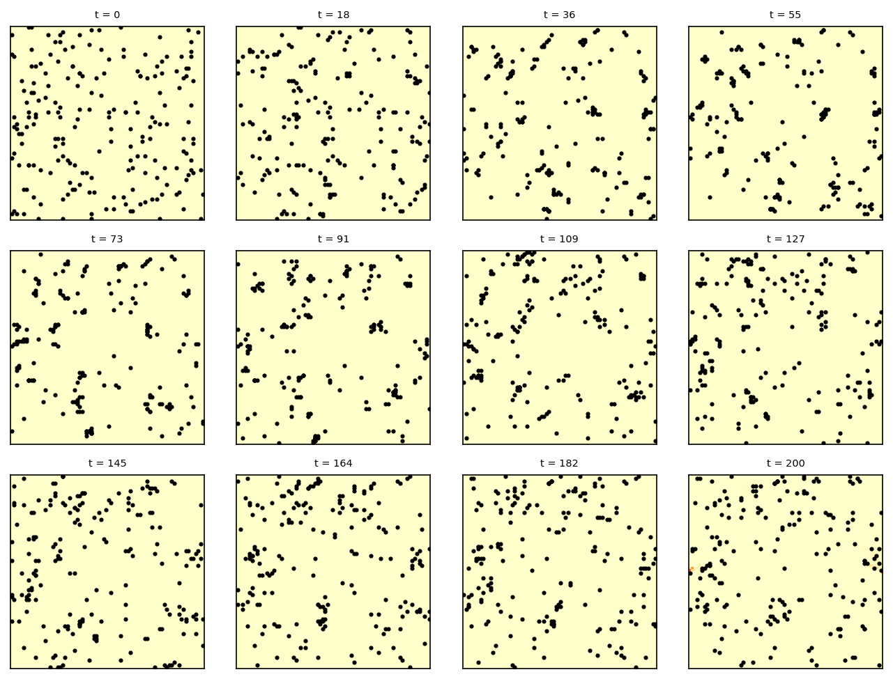
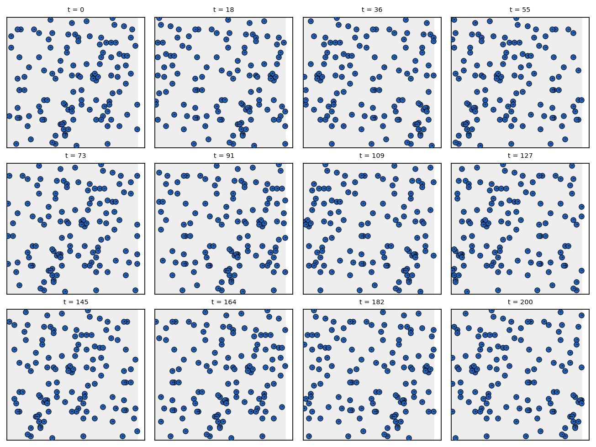
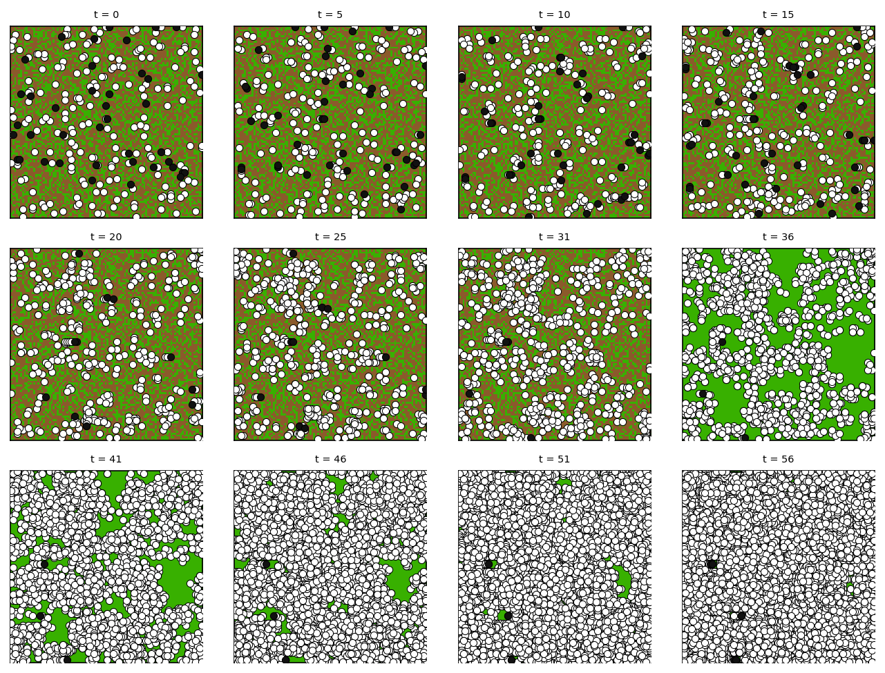
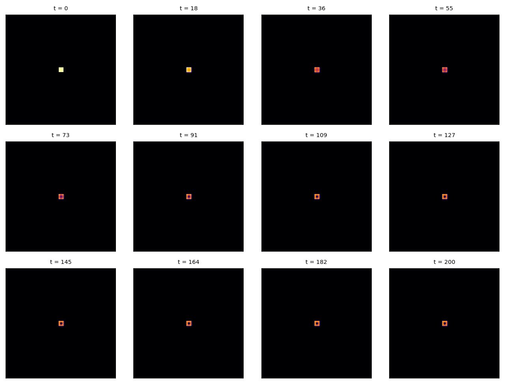

# Swarmlet

A small functional language for simulating cellular automata and agent-based swarms on a 2D grid.

Swarmlet borrows its world model from NetLogo, its syntax from OCaml/ML (`let`, `match ... with | ... ->`), and its field operators from Protelis and field calculus. The design philosophy: "the smallest language that lets you write Boids, ants, predator-prey, reaction-diffusion, and forest fire elegantly, and nothing more."

## Installation

Requires Python 3.9+ and numpy. On systems with an externally-managed Python (e.g. Homebrew, Debian/Ubuntu with PEP 668), install into a virtual environment:

```bash
python3 -m venv .venv
source .venv/bin/activate
pip install -e ".[dev]"
```

If your Python install permits global `pip install`, you can skip the venv step.

For visualization (offline rendering of snapshots to MP4/GIF/PNG), add the optional `[viz]` extras:

```bash
pip install -e ".[viz]"
```

This adds matplotlib, imageio (with ffmpeg), and pillow, and enables the `swarmlet-viz` CLI.

## Quickstart

Run the forest fire model for 100 ticks:

```bash
swarmlet run swarmlet/examples/forest_fire.swl --ticks 100 --seed 42
```

Export snapshots to JSONL:

```bash
swarmlet run swarmlet/examples/forest_fire.swl --ticks 1000 --seed 42 --out output.jsonl
```

Check a program without running:

```bash
swarmlet check swarmlet/examples/forest_fire.swl
```

Override parameters at runtime:

```bash
swarmlet run swarmlet/examples/forest_fire.swl --ticks 500 -p growth_rate=0.005
```

See [docs/quickstart.md](docs/quickstart.md) for a full walkthrough.

## Reference Examples

Five reference programs exercise every feature in the language:

| Example | Type | Key features |
|---------|------|-------------|
| `forest_fire.swl` | Pure CA | Cell rules, `let`-in, `match`, params |
| `ants.swl` | Agents + stigmergy | Pheromone field, `argmax_neighbor`, carrying state |
| `boids.swl` | Agent coordination | `mean_heading_in_radius`, separation/alignment |
| `wolf_sheep.swl` | Predator-prey | `kill`, `spawn`, `die`, multiple agent types |
| `gray_scott.swl` | Reaction-diffusion | `laplacian`, `clamp`, continuous fields |

## Architecture

```
source -> tokens -> AST -> analysis -> evaluation -> simulation
```

- **Lexer** (`lexer.py`): Tokenizes source
- **Parser** (`parser.py`): Recursive descent producing AST
- **Analyzer** (`analyzer.py`): Static semantic checks
- **Evaluator** (`eval.py`): Expression and action evaluation
- **Engine** (`engine.py`): World state, two-phase tick (cell + agent)
- **Snapshot** (`snapshot.py`): JSONL and NPZ serialization
- **CLI** (`cli.py`): `run` and `check` commands

## API

```python
from swarmlet.parser import parse
from swarmlet.engine import World

prog = parse(open("forest_fire.swl").read())
world = World(prog, seed=42)
world.step(1000)
snap = world.snapshot()
```

See [docs/api.md](docs/api.md) for full API reference.

## Testing

```bash
pytest tests/                     # all tests
pytest tests/unit/                # unit tests only
pytest tests/integration/         # integration tests
```

The **determinism harness** (`tests/integration/test_determinism.py`) verifies that two runs with the same seed produce identical snapshot sequences for all five reference examples.

## Visualization

The interpreter is a pure engine — it does not draw anything. A separate offline renderer, `swarmlet-viz`, consumes the JSONL/NPZ snapshot files produced by `swarmlet run --out` and produces MP4 videos, animated GIFs, single-frame PNGs, and contact sheets.

```
swarmlet run  ─►  snapshots.jsonl  ─►  swarmlet-viz render  ─►  out.mp4 / .gif / .png
```

Quickstart:

```bash
pip install -e ".[viz]"
swarmlet run swarmlet/examples/forest_fire.swl --ticks 1000 --seed 42 --out fire.jsonl
swarmlet-viz render fire.jsonl --preset forest_fire --out fire.mp4
```

Built-in presets are available for all five reference examples: `forest_fire`, `ants`, `boids`, `wolf_sheep`, `gray_scott`. See [docs/viz-usage.md](docs/viz-usage.md) for all CLI flags, preset details, and recipes.

### Gallery

Each image below is a contact sheet of 12 evenly-spaced frames from a 200-tick seeded run.

| | |
|---|---|
| Forest Fire | Ants |
|  |  |
| Boids | Wolf-Sheep |
|  |  |
| Gray-Scott | |
|  | |

An interactive web viewer (Stage 2B) is planned for future work — it will consume the same snapshot files as this offline renderer.

## Specification

The authoritative language design document is [specification/Swarmlet-SPEC.md](specification/Swarmlet-SPEC.md).

## License

MIT
